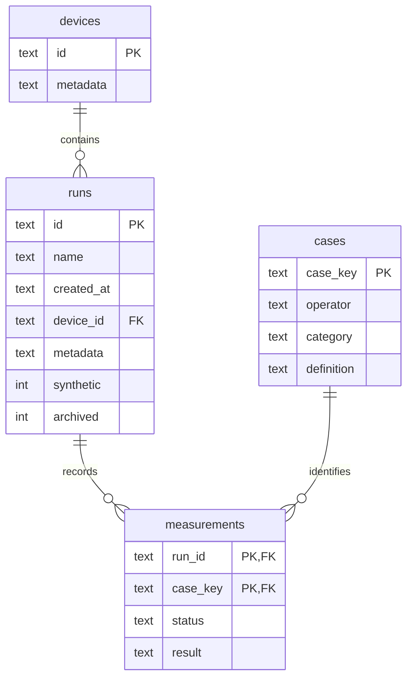

# HTTP API 与数据库

同源 JSON API。若配置 `OPBENCH_API_TOKEN`，除 `/api/health` 外所有 API 需要 `Authorization: Bearer TOKEN`；静态资源公开以加载登录入口。写请求 Content-Type 必须为 application/json；浏览器跨 Origin 写入被拒绝。没有远程代码执行端点。

| 方法 | 路径 | 行为 |
|---|---|---|
| GET | /api/health | status、schema_version、auth_required |
| GET | /api/runs?archived=0 | 活动运行列表；archived=1 为归档 |
| GET | /api/runs/{id} | 完整 v1 结果，可直接重新导入 |
| POST | /api/import | v1 JSON，201 返回 {id,count} |
| POST | /api/runs/{id}/archive | {"archived":true/false}；可恢复 |
| GET | /api/compare?left={id}&right={id} | 两运行的配置并集、配对结果、环境差异 |
| GET | /api/devices | 设备元数据 |
| GET | /api/catalog | 六大算子族与全部算子 |
| GET | /api/templates | 已提交模板 |
| POST | /api/templates/validate | 展开声明式模板，返回 {count,cases} |

错误返回 `{ "error": "..." }`：400 参数错误、401 token 错误、403 跨源写入、404 资源不存在、413 请求过大、415 内容类型错误、500 内部错误。

对比响应不分页：前端对完整并集筛选、排序、汇总后分页。因此统计卡片对应整个筛选集，CSV 也导出整个筛选集。适用于单机算子测试规模；大规模多租户场景应将分页和聚合迁移到服务端。

## 表结构

SQLite WAL + 外键 + 每请求独立连接。导入在一个事务中创建设备、运行、用例和测量；异常回滚。连接在上下文退出时显式关闭，兼容 Windows 文件锁。schema_version 表当前为 1；无破坏性自动迁移。归档只修改 runs.archived，不物理删除。

运行和测量的 JSON 保存完整扩展信息，固定的身份/索引字段独立列化。cases 主键由语义定义决定；同一用例可以有多个运行的测量。
